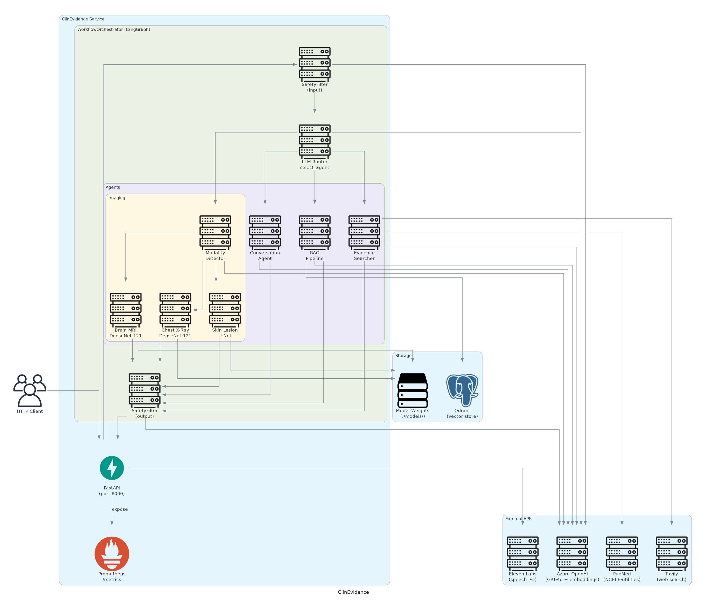

<p align="center"></p>

<h1 align="center">ClinEvidence</h1>

<p align="center">Clinical evidence retrieval and diagnostic support for ICU teams, powered by multi-agent AI.</p>

<p align="center">
  <a href="https://github.com/Hilary-Henshaw/clin-evidence/actions/workflows/ci.yml"></a>
  <a href="https://github.com/Hilary-Henshaw/clin-evidence/actions/workflows/ci.yml"></a>
  <a href="LICENSE"></a>
  <a href="https://github.com/Hilary-Henshaw/clin-evidence/releases"></a>
  <a href="https://www.python.org/downloads/"></a>
</p>

<p align="center">
  <a href="#key-features">Features</a> |
  <a href="#quick-start">Quick Start</a> |
  <a href="#architecture">Architecture</a> |
  <a href="#api-endpoints">API</a> |
  <a href="#configuration-reference">Configuration</a> |
  <a href="#deployment-targets">Deployment</a> |
  <a href="#runbook">Runbook</a> |
  <a href="#contributing">Contributing</a>
</p>

---

## Why this project?

ICU clinicians face a familiar problem: the evidence they need is scattered across dense PDF guidelines, recent PubMed abstracts, and institutional knowledge bases, and there is no fast path from a bedside question to a cited, safety-checked answer. Existing chat tools either lack grounding in clinical literature, produce responses without mandatory disclaimers, or cannot handle medical images at all.

ClinEvidence was built to close those gaps. It ingests your own clinical guidelines as a searchable vector store, falls back to live PubMed and web search when local confidence is low, runs three specialist imaging classifiers for brain MRI, chest X-ray, and skin lesion inputs, and wraps every answer in dual-layer safety filtering before delivery. Imaging results require explicit clinician approval before the workflow completes, making the human the final authority.

---

## Key Features

- **LangGraph stateful multi-agent orchestration** with a native interrupt node that suspends the workflow mid-graph until a clinician approves or rejects an imaging analysis, then resumes exactly where it left off.
- **Hybrid RAG pipeline** combining BM25 sparse retrieval and AzureOpenAI dense embeddings in Qdrant, followed by cross-encoder reranking with `ms-marco-TinyBERT-L-6`. When local knowledge base confidence drops below 0.40, the system automatically escalates the query to live web and PubMed search.
- **Docling PDF ingestion with vision-enhanced chunking** that extracts markdown, tables, formulas, and images from clinical PDFs. Image placeholders are replaced by GPT-4o vision summaries, making figure content searchable alongside prose.
- **Three custom medical imaging classifiers**: a DenseNet-121 model for 4-class brain tumour classification, a DenseNet-121 model for COVID-19/normal chest X-ray screening, and a U-Net encoder-decoder model for 7-class dermatology lesion classification.
- **GPT-4o vision modality detection** that classifies every uploaded image as BRAIN_MRI, CHEST_XRAY, SKIN_LESION, OTHER, or NON_MEDICAL before dispatching it to the appropriate specialist model.
- **Dual-layer safety filtering** with asymmetric failure semantics: the input filter fails open (allows on LLM error) so clinicians are never blocked during outages, while the output filter fails closed (blocks on LLM error) because an unverified response reaching a patient is the worse outcome.
- **Federated PubMed and Tavily evidence search** using NCBI E-utilities (esearch then efetch) alongside Tavily advanced search, with URL-based deduplication and automatic fallback from Tavily to PubMed when fewer than two results are returned.
- **Voice interface** via ElevenLabs `scribe_v1` for speech-to-text transcription and `eleven_monolingual_v1` for text-to-speech synthesis, with generated audio served as static MP3 files.

---

## Quick Start

### Docker Compose (recommended)

The fastest way to run ClinEvidence is with Docker Compose, which starts both the application and a Qdrant vector database with health checks and shared volumes.

```bash
git clone https://github.com/OWNER/clinevidence.git
cd clinevidence

# Copy and fill in the environment template
cp .env.example .env
# Edit .env with your Azure OpenAI, ElevenLabs, and Tavily credentials

# Place PyTorch model weights in ./models/
# brain_mri.pth, chest_xray.pth, skin_lesion.pth.tar

docker-compose up -d

# Verify both services are healthy
docker-compose ps
curl http://localhost:8000/health
```

Expected health response:

```json
{
  "status": "ok",
  "version": "1.0.0",
  "knowledge_base_ready": false
}
```

`knowledge_base_ready` is `false` until you ingest at least one document. See the [Runbook](#runbook) for ingestion commands.

### Manual Setup

```bash
# Requires Python 3.11+
python3.11 -m venv .venv
source .venv/bin/activate

pip install -e ".[dev]"

cp .env.example .env
# Edit .env with your credentials

# Start the server
make run
# or:
uvicorn clinevidence.main:app --host 0.0.0.0 --port 8000 --reload
```

### Ingest your first document

```bash
clinevidence-ingest --path ./data/raw/sepsis_guidelines.pdf
```

---

## Architecture

<p align="center"></p>
<!-- TODO: export architecture diagram to assets/architecture.png -->

<details>
<summary>ASCII diagram</summary>

```
+----------------------------------------------------------+
|                      HTTP Clients                        |
+---------------------------+------------------------------+
                            |
        +-------------------v------------------------------+
        |  FastAPI (Uvicorn)                               |
        |  SlowAPI rate limit  |  CORS  |  Prometheus      |
        |  RequestTracingMiddleware                        |
        |  /v1/chat  /v1/upload  /v1/validate              |
        |  /v1/transcribe  /v1/synthesize                  |
        |  /health   /metrics   /uploads/*                 |
        +-------------------+--------------------------+---+
                            |
        +-------------------v------------------------------+
        |  WorkflowOrchestrator (LangGraph)                |
        |                                                  |
        |  START -> assess_input                           |
        |           | (safe) / -> safety_out (block)       |
        |          select_agent (LLM router)               |
        |           |                                      |
        |   +-------+-------+--------+--------+           |
        |  conv   kb_rag   web      mri   xray  skin       |
        |   +-------+-------+--------+--------+           |
        |           |                                      |
        |       check_validation                           |
        |        | (needs HITL)   | (skip)                 |
        |   await_validation  apply_output_safety          |
        |   [INTERRUPT]            |                       |
        |       ^ resume          END                      |
        |   POST /v1/validate                              |
        +---+-------+----------+-------+------------------+
            |       |          |       |
         +--v--+ +--v---+ +----v---+ +-v---------+
         |Azure| |Qdrant| |Tavily/ | |ElevenLabs |
         | OAI | |(local| |PubMed  | | STT / TTS |
         |GPT-4| |/remot| | APIs   | |           |
         +-----+ +------+ +--------+ +-----------+
                    |
           +--------v--------+
           |  PyTorch Models  |
           |  Brain MRI       |
           |  Chest X-ray     |
           |  Skin Lesion     |
           +-----------------+
```

</details>

### How a request travels through the system

A clinician submits a text query to `POST /v1/chat`. The `RequestTracingMiddleware` attaches a UUID request ID, then the session cookie is validated (or a new signed session is created). Pydantic enforces message length and strips whitespace before the request reaches the orchestrator.

Inside LangGraph, the `assess_input` node runs an LLM-based safety check on the query and, if an image was attached, calls GPT-4o vision to detect the modality. The `select_agent` node then asks a temperature-0.1 LLM router which agent is most appropriate, receiving a JSON response with the agent name and confidence score.

For a knowledge base query, the `run_knowledge_base` node enriches the query with medical synonyms and ICD codes, retrieves the top five candidates from Qdrant using hybrid BM25 plus dense search, reranks them to the top three using a cross-encoder, and synthesises a cited answer with GPT-4o. If the resulting confidence score is below 0.40, the node escalates to `run_web_evidence`, which queries Tavily and PubMed, deduplicates the results, and synthesises again.

For imaging queries, the `run_brain_mri`, `run_chest_xray`, or `run_skin_lesion` node lazy-loads the relevant PyTorch model and runs inference. These always set `requires_validation: true`, causing the `await_validation` node to interrupt the LangGraph graph. The partial response is returned to the client immediately. When the clinician calls `POST /v1/validate`, LangGraph resumes from the checkpoint.

Every response passes through `apply_output_safety`, which checks for missing disclaimers and dangerous advice. Only then does the final response reach the client.

---

## API Endpoints

| Method | Path | Tag | Auth required | Description |
|---|---|---|---|---|
| `POST` | `/v1/chat` | Clinical Queries | Session cookie | Submit a clinical text query through the multi-agent workflow |
| `POST` | `/v1/upload` | Medical Imaging | Session cookie | Upload PNG/JPG/JPEG (max 5 MB); detect modality and run analysis |
| `POST` | `/v1/validate` | Medical Imaging | Session cookie | Resume a paused workflow with a clinician approve or reject decision |
| `POST` | `/v1/transcribe` | Speech | None | Transcribe an audio file to text via ElevenLabs scribe_v1 |
| `POST` | `/v1/synthesize` | Speech | None | Convert text to MP3 via ElevenLabs; returns `/uploads/audio/<uuid>.mp3` |
| `GET` | `/health` | Health | None | Returns `{status, version, knowledge_base_ready}` |
| `GET` | `/metrics` | Prometheus | None | Prometheus scrape endpoint |
| `GET` | `/uploads/*` | Static | None | Serve generated audio and uploaded image files |
| `GET` | `/docs` | | None | Swagger UI |
| `GET` | `/redoc` | | None | ReDoc UI |

---

## Usage Examples

### Submit a clinical query

```bash
curl -X POST http://localhost:8000/v1/chat \
  -H "Content-Type: application/json" \
  -d '{
    "message": "What is the first-line vasopressor in refractory septic shock?",
    "session_id": "my-session-id-here"
  }'
```

```json
{
  "message": "Norepinephrine is the first-line vasopressor recommended in septic shock...\n\n> **Disclaimer**: This information is for educational purposes only...",
  "agent_used": "KNOWLEDGE_BASE",
  "sources": [
    {"title": "Surviving Sepsis Campaign 2021", "url": null, "page": 14, "source_type": "document"}
  ],
  "confidence": 0.82,
  "processing_time_ms": 1847,
  "session_id": "my-session-id-here",
  "requires_validation": false
}
```

### Upload a medical image for analysis

```bash
curl -X POST http://localhost:8000/v1/upload \
  -F "file=@chest_xray.jpg"
```

```json
{
  "filename": "chest_xray.jpg",
  "image_type": "CHEST_XRAY",
  "analysis": "**CHEST XRAY Analysis**\n\n**Diagnosis:** normal\n**Confidence:** 91.4%\n\n...",
  "confidence": 0.914,
  "requires_validation": true,
  "session_id": "generated-session-id"
}
```

Since `requires_validation` is `true`, the workflow is paused. Submit the clinician decision to resume it:

```bash
curl -X POST http://localhost:8000/v1/validate \
  -H "Content-Type: application/json" \
  -d '{
    "session_id": "generated-session-id",
    "approved": true,
    "feedback": "Consistent with clinical picture."
  }'
```

### Ingest a directory of clinical guidelines

```bash
clinevidence-ingest --path ./data/raw/

# Example output:
#   [1/3] sepsis_guidelines.pdf: 184 chunks, 12 images (14.3s)
#   [2/3] icu_ventilation.pdf: 97 chunks, 4 images (7.1s)
#   [3/3] aki_management.pdf: 61 chunks, 0 images (4.8s)
# ==================================================
# Ingestion complete:
#   Files processed : 3
#   Files failed    : 0
#   Total chunks    : 342
#   Total images    : 16
```

---

## Core Pipeline Stages

| Stage | Component | What it does |
|---|---|---|
| Extract | `DocumentExtractor` (Docling) | Parses PDF to markdown with OCR, tables, and formula handling |
| Format | `DocumentFormatter` | Replaces image placeholders with GPT-4o vision summaries; applies semantic chunking at temperature 0.0 |
| Embed and Index | `KnowledgeStore` | Embeds chunks with AzureOpenAI and indexes in Qdrant using COSINE distance |
| Enrich query | `QueryEnricher` | Classifies query as medical or general; expands with synonyms and ICD codes |
| Retrieve | `KnowledgeStore.hybrid_search` | Qdrant `RetrievalMode.HYBRID` (BM25 + dense) returning top-k candidates |
| Rerank | `ResultRanker` | Cross-encoder `ms-marco-TinyBERT-L-6` scores each (query, doc) pair; keeps top-3 |
| Synthesise | `AnswerSynthesizer` | GPT-4o generates a cited answer with mandatory disclaimer; confidence is the query-term coverage ratio |
| Safety gate | `SafetyFilter.check_output` | Blocks responses missing disclaimers or containing dangerous advice; fails closed on LLM error |

---

## Configuration Reference

| Variable | Env alias | Type | Default | Required | Purpose |
|---|---|---|---|---|---|
| `deployment_name` | `deployment_name` | str | | **Yes** | Azure OpenAI LLM deployment name |
| `model_name` | `model_name` | str | `gpt-4o` | No | Azure OpenAI LLM model label |
| `azure_endpoint` | `azure_endpoint` | str | | **Yes** | Azure OpenAI LLM endpoint URL |
| `openai_api_key` | `openai_api_key` | SecretStr | | **Yes** | Azure OpenAI LLM API key |
| `openai_api_version` | `openai_api_version` | str | `2024-02-15` | No | Azure OpenAI API version |
| `embedding_deployment_name` | `embedding_deployment_name` | str | | **Yes** | Azure OpenAI embedding deployment |
| `embedding_model_name` | `embedding_model_name` | str | `text-embedding-ada-002` | No | Embedding model label |
| `embedding_azure_endpoint` | `embedding_azure_endpoint` | str | | **Yes** | Azure OpenAI embedding endpoint URL |
| `embedding_openai_api_key` | `embedding_openai_api_key` | SecretStr | | **Yes** | Azure OpenAI embedding API key |
| `ELEVEN_LABS_API_KEY` | `ELEVEN_LABS_API_KEY` | SecretStr | | **Yes** | ElevenLabs speech API key |
| `TAVILY_API_KEY` | `TAVILY_API_KEY` | SecretStr | | **Yes** | Tavily web search API key |
| `HUGGINGFACE_TOKEN` | `HUGGINGFACE_TOKEN` | SecretStr | `""` | No | HuggingFace token for gated model downloads |
| `QDRANT_URL` | `QDRANT_URL` | str | `None` | No | Remote Qdrant URL; local file storage used when absent |
| `QDRANT_API_KEY` | `QDRANT_API_KEY` | SecretStr | `None` | No | API key for remote Qdrant |
| `SESSION_SECRET_KEY` | `SESSION_SECRET_KEY` | SecretStr | `change-me-in-production` | **Yes** (prod) | HMAC signing key for session cookies |
| `HOST` | `HOST` | str | `0.0.0.0` | No | Uvicorn bind host |
| `PORT` | `PORT` | int | `8000` | No | Uvicorn bind port |
| `kb_chunk_size` | | int | `512` | No | Tokens per chunk during ingestion |
| `kb_chunk_overlap` | | int | `50` | No | Token overlap between adjacent chunks |
| `kb_embedding_dim` | | int | `1536` | No | Embedding vector dimension |
| `kb_retrieval_top_k` | | int | `5` | No | Candidates retrieved from Qdrant before reranking |
| `kb_reranker_top_k` | | int | `3` | No | Documents kept after cross-encoder reranking |
| `kb_min_confidence` | | float | `0.40` | No | KB confidence threshold; queries below this escalate to web search |
| `kb_max_context_tokens` | | int | `8192` | No | Maximum context tokens passed to the synthesis prompt |
| `kb_qdrant_path` | | str | `./data/qdrant_db` | No | Local Qdrant storage directory |
| `kb_docs_path` | | str | `./data/docs_db` | No | Stored document path |
| `kb_collection_name` | | str | `clinevidence_kb` | No | Qdrant collection name |
| `kb_parsed_docs_path` | | str | `./data/parsed_docs` | No | Parsed document cache directory |
| `brain_mri_model_path` | | str | `./models/brain_mri.pth` | No | Path to Brain MRI PyTorch weights |
| `chest_xray_model_path` | | str | `./models/chest_xray.pth` | No | Path to Chest X-ray PyTorch weights |
| `skin_lesion_model_path` | | str | `./models/skin_lesion.pth.tar` | No | Path to Skin Lesion checkpoint |
| `max_upload_bytes` | | int | `5242880` | No | Maximum image upload size (5 MB) |
| `allowed_image_formats` | | list[str] | `["png","jpg","jpeg"]` | No | Accepted image file extensions |
| `rate_limit_per_minute` | | int | `30` | No | SlowAPI rate limit per remote IP address |
| `upload_dir` | | str | `./uploads` | No | Root directory for uploaded images and generated audio |
| `decision_temperature` | | float | `0.1` | No | LLM temperature for agent routing decisions |
| `conversation_temperature` | | float | `0.7` | No | LLM temperature for the conversation agent |
| `rag_temperature` | | float | `0.3` | No | LLM temperature for RAG answer synthesis |
| `search_temperature` | | float | `0.3` | No | LLM temperature for web evidence synthesis |
| `chunking_temperature` | | float | `0.0` | No | LLM temperature for semantic chunking |
| `max_conversation_messages` | | int | `20` | No | Maximum raw messages retained in conversation context |
| `search_max_results` | | int | `5` | No | Maximum combined results from Tavily and PubMed |
| `elevenlabs_voice_id` | | str | `21m00Tcm4TlvDq8ikWAM` | No | Default ElevenLabs voice ID for TTS |
| `elevenlabs_model_id` | | str | `eleven_monolingual_v1` | No | ElevenLabs TTS model identifier |

---

## Performance Benchmarks

<!-- BEGIN:benchmarks -->
| Strategy | p50 | p95 | p99 | Mean |
|----------|-----|-----|-----|------|
| KNOWLEDGE_BASE query (cold) | - | - | - | - |
| KNOWLEDGE_BASE query (warm) | - | - | - | - |
| WEB_EVIDENCE query | - | - | - | - |
| CONVERSATION query | - | - | - | - |
| Image upload and classify | - | - | - | - |

> Run `python scripts/benchmark.py` to populate this table.
<!-- END:benchmarks -->

---

## Observability

### Structured logs

All log lines are emitted as JSON to stdout:

```json
{"time": "2024-01-15T10:30:00", "level": "INFO", "logger": "clinevidence.api.chat", "message": "Request processed"}
```

The `RequestTracingMiddleware` emits one line per request with these fields:

| Field | Type | Description |
|---|---|---|
| `method` | str | HTTP method (GET, POST, ...) |
| `path` | str | Request path |
| `status_code` | int | HTTP response status |
| `duration_ms` | int | Wall-clock milliseconds for the full request |
| `request_id` | str | UUID4, either from the `X-Request-ID` header or generated |

Agent-level logs include operation-specific fields such as `agent`, `confidence`, `chunks`, `images`, `elapsed_s`, `diagnosis`, and `session_id`. Secrets never appear in logs because all API keys are stored as Pydantic `SecretStr`.

### Request tracing headers

Every response carries two headers:

| Header | Value |
|---|---|
| `X-Request-ID` | UUID4 (from client header or generated) |
| `X-Processing-Time` | Integer milliseconds |

### Health check

```bash
curl http://localhost:8000/health
```

```json
{"status": "ok", "version": "1.0.0", "knowledge_base_ready": true}
```

`knowledge_base_ready` is `true` when the Qdrant collection exists and has been populated. The Docker Compose health check polls this endpoint every 30 seconds with 3 retries.

Qdrant has its own health check at `http://localhost:6333/healthz`, polled every 15 seconds.

### Prometheus metrics

`GET /metrics` exposes all auto-instrumented FastAPI metrics via `prometheus_fastapi_instrumentator`:

- `http_requests_total` (labelled by method, handler, and status code)
- `http_request_duration_seconds` (histogram)

---

## Data Model

**WorkflowState** stored in `MemorySaver` (in-process, keyed by `session_id`)

| Field | Type | Purpose |
|---|---|---|
| `messages` | list[BaseMessage] | Full conversation history, appended via `add_messages` reducer |
| `session_id` | str | UUID4 session identifier, doubles as the LangGraph `thread_id` |
| `image_path` | str or None | Filesystem path of the uploaded image for the current turn |
| `image_type` | str or None | Detected modality: BRAIN_MRI, CHEST_XRAY, SKIN_LESION, OTHER, NON_MEDICAL |
| `selected_agent` | str or None | Routing decision: CONVERSATION, KNOWLEDGE_BASE, WEB_EVIDENCE, BRAIN_MRI, CHEST_XRAY, SKIN_LESION, SAFETY_BLOCK |
| `routing_confidence` | float | LLM routing confidence or KB answer confidence score |
| `response` | str or None | Final text response to be delivered to the client |
| `sources` | list[str] | Source URLs or document reference strings |
| `requires_validation` | bool | Whether the HITL interrupt should fire |
| `validation_approved` | bool or None | Clinician decision recorded after the interrupt resumes |
| `error` | str or None | Error code: INPUT_BLOCKED, NO_IMAGE, MODEL_NOT_FOUND, IMAGING_FAILED |

**Document chunk** stored in Qdrant collection `clinevidence_kb`

| Field | Type | Purpose |
|---|---|---|
| `page_content` | str | Text chunk content |
| `metadata.title` | str | Source document stem (filename without extension) |
| `metadata.source_file` | str | Absolute path to the original PDF |
| `metadata.chunk_index` | int | Sequential position within the document |
| `metadata.image_paths` | list[str] | Paths to images extracted from the same document |

**ImagingResult** returned from each imaging analyser (not persisted)

| Field | Type | Purpose |
|---|---|---|
| `diagnosis` | str | Predicted class label |
| `confidence` | float | Softmax probability of the predicted class |
| `explanation` | str | Clinical explanation with confidence band (high, moderate, low) |
| `model_name` | str | Human-readable model identifier |

---

## Security Model

### Session management

ClinEvidence uses signed session cookies as its only identity mechanism. There is no API key authentication, no JWT, and no OAuth layer. The `itsdangerous.URLSafeSerializer` signs a `{"session_id": "<uuid4>"}` payload using `SESSION_SECRET_KEY` with the salt `"session"`. Cookie attributes: `httponly=True`, `samesite="lax"`, `secure=False` (hardcoded; requires a code change for HTTPS deployment).

A tampered cookie returns HTTP 401. A mismatch between the cookie session and the `session_id` field in the request body returns HTTP 403.

### Input validation

- Pydantic v2 validates all request bodies before they reach route handlers.
- `message` is stripped of whitespace and clamped to 1-4096 characters.
- `session_id` is clamped to 1-128 characters. `feedback` is capped at 2048 characters. `text` for TTS is capped at 5000 characters.
- Image uploads are checked against an extension whitelist (`png`, `jpg`, `jpeg`), size-checked against `max_upload_bytes` (5 MB), and sanitised with `werkzeug.utils.secure_filename`.
- Audio uploads are checked against a format whitelist and rejected if the file is empty.
- Content-level harmful input is blocked by `SafetyFilter.check_input()`.

### CORS

Currently fully open: `allow_origins=["*"]`, `allow_credentials=True`, `allow_methods=["*"]`, `allow_headers=["*"]`. This is explicitly noted in the code as "permissive for development".

### Rate limiting

SlowAPI, keyed on remote IP address, limits each client to 30 requests per minute. The limit state is in-process, so each replica maintains its own counter independently.

### Secret management

All API keys are declared as Pydantic `SecretStr` fields. They are masked in `repr` and never written to logs. In Docker Compose deployments they are passed via `env_file: .env`. No vault integration or secret rotation mechanism is built in.

### Network boundaries

In the Docker Compose setup, the app communicates with Qdrant over Docker's internal network at `http://qdrant:6333`. Both ports 6333 and 6334 on the Qdrant container are exposed to the host. There is no TLS between services.

---

## Failure Modes

| Component | Failure | Impact | Behaviour |
|---|---|---|---|
| Azure OpenAI LLM | API error or timeout | Routing, safety checks, and synthesis affected | `select_agent` defaults to CONVERSATION; `check_input` fails open (allows); `check_output` fails closed (blocks response) |
| Azure OpenAI Embeddings | API error during ingest or search | Indexing or retrieval fails | Ingest CLI logs and skips the file; query path raises an unhandled exception causing HTTP 500 |
| Qdrant unavailable | Connection refused | All RAG queries fail | No retry; KB query raises; HTTP 500; health endpoint reports `knowledge_base_ready: false` |
| PyTorch model weights missing | `FileNotFoundError` at lazy-load | Imaging analysis unavailable | `_run_imaging` catches the error and returns a `MODEL_NOT_FOUND` response |
| PyTorch inference failure | Runtime error (OOM, corrupt weights) | Single image analysis fails | Caught by generic exception handler in `_run_imaging`; returns `IMAGING_FAILED`; HTTP 500 |
| ModalityDetector LLM error | GPT-4o vision call fails | Image not classified | `_assess_input` catches exception and returns `image_type: OTHER`; routing continues without a specialist match |
| Tavily API error | Client raises exception | Web evidence unavailable | `EvidenceSearcher` catches and returns empty list; falls back to PubMed results only |
| PubMed API error | NCBI request fails or XML malformed | PubMed results unavailable | `PubMedSearchClient` catches and returns empty list; falls back to Tavily results only |
| ElevenLabs STT error | `scribe_v1` call fails | Transcription unavailable | HTTP 502 "Transcription service unavailable" |
| ElevenLabs TTS error | `text_to_speech.convert` fails | Synthesis unavailable | HTTP 502 "Speech synthesis service unavailable" |
| Invalid session cookie | Tampered or wrong-secret cookie | Request rejected | HTTP 401 "Invalid or tampered session cookie" |
| Session ID mismatch | Cookie session does not match body | Request rejected | HTTP 403 "Session ID does not match the session cookie" |
| `MemorySaver` lost on restart | App restart | Conversation history and pending HITL interrupts lost | No persistence; clients must re-submit; imaging workflows awaiting validation are abandoned |
| Rate limit exceeded | Over 30 req/min per IP | Client blocked | SlowAPI returns HTTP 429 |
| Image too large | Upload over 5 MB | Upload rejected | HTTP 413; file is not written to disk |
| Unsupported image format | Extension not in whitelist | Upload rejected | HTTP 415 |
| Unsupported audio format | Extension not in whitelist | Upload rejected | HTTP 415 |
| Empty audio file | Zero bytes received | Upload rejected | HTTP 400 "Uploaded audio file is empty" |
| Disk full | Cannot write image or audio | Write fails | Unhandled `OSError`; HTTP 500; media endpoint cleans up partially written files in its `except` block |

---

## Scaling Considerations

**FastAPI application (stateful)**

The `WorkflowOrchestrator` is a process-level singleton. `MemorySaver` stores all conversation state and pending HITL interrupts in RAM. Running multiple replicas breaks session continuity because a request for session X must always reach the same instance. An in-flight imaging validation interrupt is silently lost if the owning replica restarts.

Horizontal scaling requires externalising session storage (a PostgreSQL-backed LangGraph checkpointer) and moving rate limit counters to Redis.

**Qdrant**

In local file mode (`QdrantClient(path=...)`) only a single app instance can write to the store. Setting `QDRANT_URL` to a dedicated Qdrant instance removes this constraint and lets multiple app replicas share one vector database. Qdrant itself supports clustering for read scaling.

**PyTorch imaging models**

Models are lazy-loaded into memory on the first inference request and held for the process lifetime. GPU memory is the primary bottleneck. Multiple app replicas each load their own copy of the weights, so GPU-equipped instances can scale horizontally once session state is externalised.

**LLM and embedding calls**

All LLM and embedding calls are synchronous and run inside async FastAPI route handlers, blocking the event loop for the duration of each call. A production hardening step would run orchestrator calls in a thread pool via `loop.run_in_executor` to restore event-loop responsiveness under concurrent load.

---

## Design Decisions

**Azure OpenAI rather than standard OpenAI**
Enterprise deployments need data residency guarantees and per-deployment key management. Separate deployments for the LLM and for embeddings allow independent versioning and quota management. The trade-off is tight coupling to Azure: switching providers requires changing every `AzureChatOpenAI` and `AzureOpenAIEmbeddings` instantiation.

**LangGraph for orchestration rather than raw Python or a simpler chain**
LangGraph's `MemorySaver` checkpointing and the native `interrupt` primitive make human-in-the-loop workflows first-class. A POST to `/v1/validate` can resume a graph that was suspended by a completely different HTTP request. The trade-off is that `MemorySaver` is in-process and state is lost on restart.

**Qdrant hybrid retrieval (BM25 + dense cosine)**
Clinical text is full of precise terminology such as drug names and ICD codes that dense-only retrieval misses when there is no semantic paraphrase in the training distribution. BM25 recovers exact-match cases. The trade-off is that the BM25 sparse index adds memory per collection compared with a dense-only store.

**Cross-encoder reranking as a second stage after Qdrant**
Bi-encoder retrieval maximises recall but is imprecise. The cross-encoder scores full query-document pairs and reduces the top-5 candidates to top-3 before synthesis, cutting LLM context length and improving answer precision. The trade-off is additional latency and the need to download and host the reranker model locally.

**Docling for PDF ingestion**
Clinical guidelines contain complex tables, chemical formulas, and embedded images. Docling handles all three with an OCR fallback. Image placeholders are replaced by GPT-4o vision summaries, making figure content searchable. The trade-off is a heavy dependency: Docling pulls in its own ML models.

**Asymmetric safety filter failure semantics**
The input filter fails open so clinicians are never blocked during LLM outages. The output filter fails closed because an unreviewed AI response reaching a patient is a worse failure than a temporary service degradation. The trade-off is that output safety adds one extra LLM call per response, and a prolonged outage blocks all responses.

**itsdangerous signed cookies for sessions**
Stateless, tamper-evident, and zero extra infrastructure required. The trade-off is that sessions cannot be invalidated server-side, secret rotation invalidates all active sessions, and the approach is unsuitable for multi-replica deployments without a shared backing store.

**SlowAPI rate limiting keyed on remote IP**
No API-key authentication layer exists, so IP-based limiting is the only option. It provides basic DoS protection with no added infrastructure. The trade-off is that the counter is in-process, so the effective per-IP limit scales with replica count.

**Separate PyTorch weight files per imaging modality**
Each clinical modality has a distinct input distribution and class taxonomy. Separate models can be updated, swapped, or versioned independently. The trade-off is that all three files must be manually downloaded and placed before imaging endpoints are functional, and missing weights cause a runtime error at inference time rather than at startup.

---

## API Error Reference

| HTTP Status | Raised by | Meaning | How to fix |
|---|---|---|---|
| 400 | `POST /v1/transcribe` | Uploaded audio file is empty | Send a non-empty audio file |
| 401 | All session-protected endpoints | Session cookie signature is invalid or tampered | Clear the `clinevidence_session` cookie and start a new session |
| 403 | `POST /v1/chat`, `POST /v1/validate` | `session_id` in the request body does not match the signed cookie | Ensure the `session_id` field matches the value stored in your session cookie |
| 413 | `POST /v1/upload` | File exceeds the 5 MB maximum | Reduce image file size below 5 MB |
| 415 | `POST /v1/upload` | Image format not in `["png","jpg","jpeg"]` | Convert the image to PNG or JPEG before uploading |
| 415 | `POST /v1/transcribe` | Audio format not in the allowed set | Use mp3, mp4, mpeg, mpga, m4a, wav, or webm |
| 422 | All POST endpoints | Pydantic validation error (missing field, wrong type, or length out of range) | Check the request body against the schema; `message` must be 1-4096 chars, `session_id` 1-128 chars |
| 429 | All endpoints | Rate limit exceeded (over 30 requests per minute per IP) | Reduce request frequency |
| 500 | `POST /v1/chat` | Orchestrator raised an unhandled exception | Check application logs for the stack trace; likely an LLM or Qdrant connectivity problem |
| 500 | `POST /v1/upload` | Image analysis pipeline failed | Verify model weights exist in `./models/`; check application logs |
| 500 | `POST /v1/validate` | Validation resumption failed | Verify the session exists and has a pending interrupt; the session may need to be re-created if the app restarted |
| 502 | `POST /v1/transcribe` | ElevenLabs STT service error | Verify `ELEVEN_LABS_API_KEY` is valid; check ElevenLabs service status |
| 502 | `POST /v1/synthesize` | ElevenLabs TTS service error | Verify `ELEVEN_LABS_API_KEY` is valid; check ElevenLabs service status |

---

## Runbook

### Start and stop the stack

```bash
# Start both services
docker-compose up -d

# Stop without removing data
docker-compose stop

# Stop and remove containers (data volumes preserved)
docker-compose down

# Full teardown including volumes
docker-compose down -v
```

### Restart individual services

```bash
docker-compose restart qdrant
docker-compose restart app

# Direct Docker commands
docker restart clinevidence-app
docker restart clinevidence-qdrant
```

### Ingest documents into the knowledge base

```bash
# Single PDF
clinevidence-ingest --path ./data/raw/sepsis_guidelines.pdf

# All PDFs in a directory (recursive)
clinevidence-ingest --path ./data/raw/

# Use a custom collection name
clinevidence-ingest --path ./data/raw/ --collection staging_kb

# Via Makefile
make ingest PATH_ARG=./data/raw/
```

### Rebuild (wipe and re-index) the vector store

```bash
docker-compose stop app
rm -rf ./data/qdrant_db      # WARNING: destroys all indexed data
docker-compose start app
clinevidence-ingest --path ./data/raw/
```

### Clear uploaded files

```bash
rm -rf ./uploads/images/*
rm -rf ./uploads/audio/*
```

### Check system health

```bash
curl -s http://localhost:8000/health | python3 -m json.tool
curl -s http://localhost:6333/healthz          # Qdrant
curl -s http://localhost:8000/metrics | head   # Prometheus scrape
```

### Roll back a deployment

```bash
# Tag the current image before deploying a new version
docker tag clinevidence:latest clinevidence:previous

# Roll back by running the previous image
docker stop clinevidence-app
docker run --rm -p 8000:8000 \
  --env-file .env \
  -v $(pwd)/data:/app/data \
  -v $(pwd)/models:/app/models \
  -v $(pwd)/uploads:/app/uploads \
  clinevidence:previous
```

### Rotate SESSION_SECRET_KEY

```bash
# Generate a new key
python3 -c "import secrets; print(secrets.token_hex(32))"

# Update .env
# SESSION_SECRET_KEY=<new-value>

# Restart to reload settings
# NOTE: all existing client sessions are invalidated on restart
docker-compose restart app
```

### Rotate API keys

```bash
# Update the relevant key in .env (openai_api_key, TAVILY_API_KEY, etc.)
# Restart to reload the lru_cache singleton
docker-compose restart app
```

### View application logs

```bash
docker-compose logs -f app
docker-compose logs -f qdrant
```

---

## Local Development Tips

**The orchestrator initialises on the first request, not at startup.** The `WorkflowOrchestrator` singleton is LRU-cached behind `get_orchestrator()`. The very first request after a cold start triggers LangGraph graph compilation, `MemorySaver` initialisation, and a Qdrant connection. This can cause the first request to time out if Qdrant is still starting up.

**Model weights are not bundled and are not downloaded automatically.** The three PyTorch files must be placed manually in `./models/` before any imaging endpoint can serve requests. Because models are lazy-loaded, a missing weights file only surfaces as a `MODEL_NOT_FOUND` error at the first imaging request, not at server start.

**`secure=False` on session cookies is hardcoded.** The inline comment says "Set to True in production with HTTPS" but this is not a configuration option. It requires changing one line in `dependencies.py`.

**If you run the app outside Docker but use the Compose Qdrant container,** set `QDRANT_URL=http://localhost:6333` in your `.env`. The Compose file overrides `QDRANT_URL` to `http://qdrant:6333` (the internal Docker hostname), which is not reachable from the host.

**`routing_confidence_threshold` (default 0.85) is stored but currently unused as a gate.** The threshold that actually triggers web search escalation is `kb_min_confidence` (default 0.40), evaluated inside `_run_knowledge_base`.

**The minimum coverage threshold is 48%.** This is intentionally low because integration tests require live API keys and are separated from the unit test suite. Run `make test-unit` if you do not have credentials configured locally.

**`clinevidence-ingest --collection` mutates the `Settings` singleton.** The ingest CLI sets `settings.kb_collection_name` directly on the cached instance. This works cleanly when the CLI is run as a standalone process but would affect the entire app if called in-process.

**Audio and image files accumulate without cleanup.** Generated MP3s in `./uploads/audio/` and uploaded images in `./uploads/images/<session_id>/` persist indefinitely. There is no TTL or garbage collection job; clear them manually with `rm -rf ./uploads/images/* ./uploads/audio/*`.

**MyPy strict mode is intentionally disabled.** FastAPI route decorators, Pydantic subclassing, and PyTorch `nn.Module` all produce unavoidable false positives without vendored stubs. The `pyproject.toml` comment explains this explicitly.

**`asyncio_mode = "auto"` is enabled.** All async test functions run automatically without `@pytest.mark.asyncio` decorators.

---

## Known Limitations

- **In-memory session storage only.** `MemorySaver` is process-local. Multi-replica deployments will break session continuity and lose pending imaging validation interrupts on restart. PostgreSQL-backed session persistence is on the roadmap.
- **No distributed rate limiting.** SlowAPI counters are per-process. Multiple replicas effectively multiply the allowed rate per IP. A Redis-backed limiter is needed for consistent enforcement across replicas.
- **CORS is fully open.** `allow_origins=["*"]` is explicitly marked as development-only. No production CORS configuration is shipped.
- **`secure=False` on session cookies** is hardcoded and requires a source code change to enable for HTTPS deployments.
- **No DICOM support.** Only PNG, JPG, and JPEG are accepted. DICOM is the standard clinical imaging format and is listed as a planned feature.
- **English only.** Clinical guidelines and all prompts are English-only. Multi-language support is planned.
- **No feedback loop.** Answer quality ratings from clinicians are not stored or used to improve retrieval or synthesis quality over time.
- **No fine-tuned embeddings.** The system uses the generic `text-embedding-ada-002` model. Clinical-domain fine-tuned embeddings would likely improve retrieval precision.
- **No FHIR integration.** There is no mechanism to inject patient-specific context from an EHR system.
- **PyTorch model weights are not provided.** No download script or HuggingFace Hub integration exists; weights must be sourced and placed manually.
- **ElevenLabs calls have no retry logic.** A single transient failure immediately returns HTTP 502.
- **Orchestrator calls block the event loop.** All LLM and inference calls are synchronous inside async route handlers.
- **No conversation summarisation.** History is truncated to the last 20 raw messages with no summarisation of older context.
- **Uploaded files and generated audio are never cleaned up** by the application.

---

## Project Structure

```
clinevidence/
├── .env.example                  # Environment variable template with all required keys
├── .github/
│   ├── workflows/
│   │   ├── ci.yml                # Lint, type-check, and test pipeline
│   │   └── release.yml           # Release automation
│   └── dependabot.yml            # Automated dependency updates
├── CHANGELOG.md                  # Version history
├── CONTRIBUTING.md               # Contribution guidelines
├── LICENSE                       # MIT License
├── Makefile                      # Development shortcuts for install, lint, test, docker
├── README.md                     # This file
├── docker-compose.yml            # Qdrant and app with health checks and shared volumes
├── Dockerfile                    # Single-stage Python 3.11 image
├── pyproject.toml                # Package metadata, dependencies, ruff/mypy/pytest config
├── docs/                         # Extended documentation
│   ├── api-reference.md
│   ├── architecture.md
│   ├── configuration.md
│   ├── deployment.md
│   ├── development.md
│   └── troubleshooting.md
├── examples/                     # Runnable usage examples
│   ├── basic-query/              # Simple chat query via Python
│   ├── document-ingestion/       # Batch PDF ingestion example
│   └── medical-imaging/          # Image upload and analysis example
├── src/clinevidence/             # Main installable package
│   ├── __init__.py               # Package version: 1.0.0
│   ├── main.py                   # FastAPI app factory, lifespan hooks, run() entry point
│   ├── settings.py               # Pydantic-Settings singleton with lru_cache
│   ├── middleware.py             # RequestTracingMiddleware (X-Request-ID, X-Processing-Time)
│   ├── dependencies.py           # get_orchestrator, get_session, create_session
│   ├── api/                      # FastAPI routers
│   │   ├── chat.py               # POST /v1/chat
│   │   ├── media.py              # POST /v1/upload, POST /v1/validate
│   │   └── speech.py             # POST /v1/transcribe, POST /v1/synthesize
│   ├── models/                   # Pydantic request and response schemas
│   │   ├── requests.py           # ChatRequest, ValidationRequest, SpeechRequest
│   │   └── responses.py          # ChatResponse, UploadResponse, HealthResponse, etc.
│   ├── agents/                   # All agent and pipeline logic
│   │   ├── state.py              # WorkflowState TypedDict
│   │   ├── orchestrator.py       # WorkflowOrchestrator (builds and runs the LangGraph graph)
│   │   ├── conversation.py       # ConversationAgent (general clinical Q&A)
│   │   ├── safety_filter.py      # SafetyFilter (input and output guards)
│   │   ├── rag/                  # Retrieval-augmented generation sub-pipeline
│   │   │   ├── pipeline.py       # KnowledgeBase (ingest and query orchestration)
│   │   │   ├── knowledge_store.py# KnowledgeStore (Qdrant hybrid retrieval)
│   │   │   ├── document_extractor.py  # Docling-based PDF extraction
│   │   │   ├── document_formatter.py  # GPT-4o image summaries and semantic chunking
│   │   │   ├── query_enricher.py # Medical term expansion (synonyms, ICD codes)
│   │   │   ├── result_ranker.py  # Cross-encoder reranking
│   │   │   └── answer_synthesizer.py  # Cited answer generation with confidence scoring
│   │   ├── search/               # Web and PubMed evidence search
│   │   │   ├── search_processor.py    # EvidenceSearchProcessor (orchestrates search and synthesis)
│   │   │   ├── evidence_searcher.py   # Deduplication and Tavily-to-PubMed fallback
│   │   │   ├── tavily_client.py  # Tavily advanced search wrapper
│   │   │   └── pubmed_client.py  # NCBI E-utilities (esearch and efetch)
│   │   └── imaging/              # Medical image analysis
│   │       ├── modality_detector.py   # GPT-4o vision modality classifier
│   │       ├── router.py         # ImagingRouter (dispatches to specialist analyser)
│   │       ├── brain_mri.py      # DenseNet-121, 4-class brain tumour classification
│   │       ├── chest_xray.py     # DenseNet-121, 2-class chest X-ray classification
│   │       └── skin_lesion.py    # U-Net encoder-decoder, 7-class dermatology
│   └── scripts/
│       └── ingest.py             # clinevidence-ingest CLI entry point
└── tests/
    ├── conftest.py               # Shared pytest fixtures and mocks
    ├── unit/                     # Mocked unit tests (no API keys required)
    │   ├── test_modality_detector.py
    │   ├── test_query_enricher.py
    │   ├── test_result_ranker.py
    │   └── test_safety_filter.py
    └── integration/              # End-to-end tests (require live API keys)
        ├── test_chat_endpoint.py
        └── test_rag_pipeline.py
```

---

## Development Setup

```bash
# Clone and set up the virtual environment
git clone https://github.com/OWNER/clinevidence.git
cd clinevidence

python3.11 -m venv .venv
source .venv/bin/activate
pip install -e ".[dev]"

# Copy and configure environment
cp .env.example .env
# Fill in Azure OpenAI, ElevenLabs, and Tavily credentials

# Place model weights
mkdir -p models
# Copy brain_mri.pth, chest_xray.pth, skin_lesion.pth.tar into ./models/

# Run the dev server with hot reload
make run
```

### Test commands

```bash
# Unit tests (no API keys required)
make test-unit

# Integration tests (require live credentials in .env)
make test-integration

# Full suite with coverage report
make test

# HTML coverage report at htmlcov/index.html
make coverage

# Lint
make lint

# Auto-format
make format

# Type checking
make type-check
```

---

## Deployment Targets

| Target | Command | Notes |
|---|---|---|
| Docker Compose (recommended) | `docker-compose up -d` | Starts Qdrant and the app together; Qdrant data persisted in named volume `qdrant_data`; mounts `./data`, `./models`, `./uploads` |
| Docker (app only) | `make docker-run` | Requires an external Qdrant instance; set `QDRANT_URL` in `.env` |
| Build Docker image | `make docker-build` | Tags as `clinevidence:latest` |
| Local dev with hot reload | `make run` | `uvicorn ... --reload`; uses local Qdrant file store |
| Local production-like | `clinevidence` | Calls `uvicorn.run` with `reload=False`; reads settings from `.env` |
| Python wheel | `make build` | Produces a pip-installable wheel via Hatchling in `dist/` |

No Kubernetes manifests, Helm charts, or cloud-provider-specific configurations are included in the repository.

---

## Roadmap

### Done (v1.0.0)

- LangGraph multi-agent orchestration with HITL interrupt and MemorySaver checkpointing
- Qdrant hybrid RAG pipeline (BM25 + dense, cross-encoder reranking, confidence-threshold escalation)
- Docling PDF ingestion with GPT-4o vision image summarisation and semantic chunking
- Dual-layer safety filtering with asymmetric failure semantics
- Brain MRI, chest X-ray, and skin lesion imaging classifiers
- GPT-4o vision modality detection
- Tavily and PubMed federated evidence search with LLM synthesis
- ElevenLabs voice interface (STT and TTS)
- Signed session cookie management
- Prometheus metrics, structured JSON logging, and request tracing
- `clinevidence-ingest` CLI for batch PDF ingestion
- Docker Compose deployment

### In Progress

- Production CORS configuration (currently open for development)
- HTTPS-ready session cookie flag (currently hardcoded `secure=False`)

### Planned

- PostgreSQL-backed session persistence to replace in-memory `MemorySaver`
- DICOM medical image format support
- Multi-language clinical guidelines
- Feedback loop for RAG answer quality improvement
- Fine-tuned clinical embeddings to improve retrieval precision
- FHIR integration for patient context injection
- Distributed rate limiting via Redis

---

## Tech Stack

<p align="center">
  
  
  
  
  
  
  
  
  
  
  
  
  
  
  
</p>

---

## Contributing

Contributions are welcome. Please read [CONTRIBUTING.md](CONTRIBUTING.md) for the commit conventions, branch strategy, and code quality requirements before opening a pull request.

```bash
# Install dev dependencies
make install-dev

# Verify your changes pass all checks before submitting
make lint && make type-check && make test-unit
```

---

## License and Acknowledgments

Released under the [MIT License](LICENSE).

ClinEvidence is built on top of several excellent open-source projects and services:

- [LangGraph](https://github.com/langchain-ai/langgraph) for stateful multi-agent orchestration
- [Qdrant](https://github.com/qdrant/qdrant) for hybrid vector search
- [Docling](https://github.com/DS4SD/docling) for clinical PDF extraction
- [sentence-transformers](https://github.com/UKPLab/sentence-transformers) for cross-encoder reranking
- [FastAPI](https://github.com/tiangolo/fastapi) for the REST API layer
- [NCBI E-utilities](https://www.ncbi.nlm.nih.gov/books/NBK25501/) for PubMed literature access

This software is intended to assist qualified clinicians and does not replace clinical judgement.
